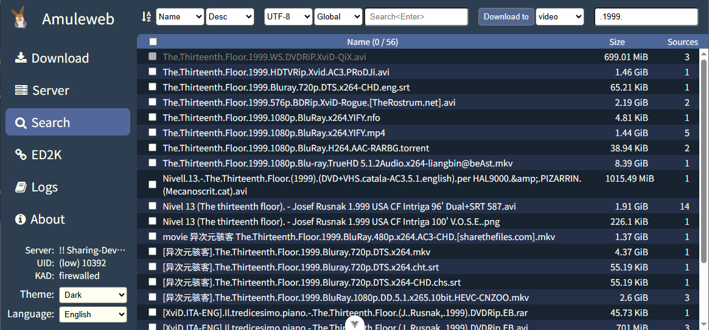

English [简体中文](README-zh.md)

amule-m26 improves upon the aMule project. Check the [patch file](docker/tmp/m26.patch) for code changes.

This web UI does not compatible with the original aMule project, so you have to use amule-m26 as the backend. There's a pre-built Docker image available, which is base on [ngosang/docker-amule](https://github.com/ngosang/docker-amule).

### Usage

```bash
docker pull ghcr.io/jjling2011/amule-m26:latest
```

All configurations are the same as [ngosang/docker-amule](https://github.com/ngosang/docker-amule), except `Template=M26` in amule.conf.

### Screen shot



### Missing features

- upload tasks list
- statistic graph

I don't think these features are important.

### Credits

- https://github.com/ngosang/docker-amule
- https://github.com/MatteoRagni/AmuleWebUI-Reloaded/
- https://github.com/amule-project/amule
